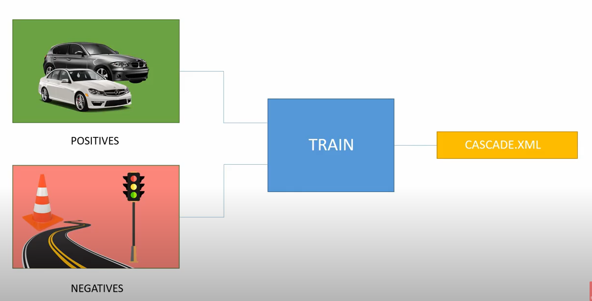

Link: https://www.youtube.com/watch?v=dZ4itBvIjVY

Flow:

# collect data
có 1 số cách như:
- có thể search trong gg images và dùng chrome extension: `FATKUN` để download batch images [fatkun](images/fatkun.png)
- dùng webcam và save image theo frame

Sau khi collect xong, chia thành 2 folder: positive và negative

# train
sử dụng [CASCADE TRAINER GUI](https://amin-ahmadi.com/cascade-trainer-gui/) và train
