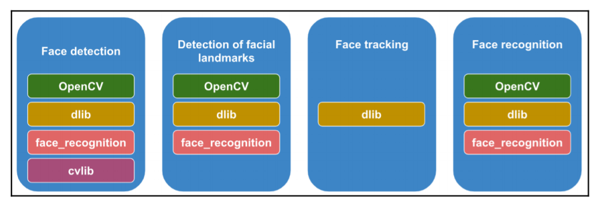
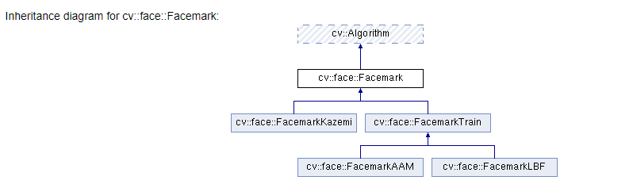

# 1. ml with opencv
## a. color quantization with kmeans
=> giảm bớt số lượng màu sắc trong ảnh sử dụng kmeans

các bước thực hiện:
1. reshape img array sang (-1,3) 
2. sử dụng kmeans để tạo thành các cụm => lấy center của mỗi cụm là màu sắc đại diện cho cụm đó (nhớ convert về int sau khi có center từ kmeans)
3. từ img array => convert sang label => từ label convert sang center của label đó

## b. classification with knn & svm
trong sách đã thực hiện bài toán nhận diện chữ số viết tay.

- đầu tiên họ đã thử nghiệm vs k (trong knn) và % data training khác nhau để so sánh

Tuy nhiên điểm hay của phần này là họ đã thực hiện preprocessing data trước khi train và đã improve performance:

- preprocessing1: de-skew (khử độ lệch của chữ số trong ảnh) bằng cách xác định ảnh lệch =  `cv2.momments` và xoay ảnh lại sử dụng `cv2.warpAffine` => pp này đã giúp tăng acc (training 50%, k = 3) từ 92.6 lên 95% (các thử nghiệm khác cũng tăng, nhưng mình lấy 1 mốc để so sánh) 
- preprocessing2: ngoài deskew, sử dụng thêm descriptor Histogram of Oriented Gradients (HOG) => 1 loại image descriptor phổ biến => acc (cùng đkien 50% train, k=3) tăng lên ~98%

tham khảo thêm về HOG: https://phamdinhkhanh.github.io/2019/11/22/HOG.html

- svm (sử dụng HOG và deskew) cho acc (50% train) đến 98.6%, khi thực hiện tuning hyperparameter, acc lên đến 99.2%

```markdown
theo mình các algorithm trên vẫn nên dùng sklearn, còn opencv chỉ để xử lý ảnh trước
=> vì vậy nếu đã biết sklearn, mình nghĩ chỉ nên đọc qua cách sử dụng là đc
```
# 2. deep learning

```markdown
để benchmark task object detection, có 3 dataset đc sử dụng:
  - PASCAL VOC (PASCAL Visual Object Classification) - 20 cats - 10k images
  - ImageNet - 200 cats - 500k images
  - COCO (Common Objects in Context) - 2.5M labels trong 328k images

và sử dụng mAP (mean average precison)
```

## load input to blob (from image/images) 
- opencv có thể dùng các pretrain network của tf, pytorch, onnx, caffe, darknet để thực hiện inference
- `cv2.dnn.blobFromImage()`
```python
retval=cv2.dnn.blobFromImage(image[, scalefactor[, size[, mean[, swapRB[,crop[, ddepth]]]]]]) => create 4 dimension (thêm batch_size)
retval=cv2.dnn.blobFromImages(images[, scalefactor[, size[, mean[, swapRB[,crop[, ddepth]]]]]]) => create 4 dimension (thêm batch_size)
```
=> `blobFromImage` có thể resize, crop, normalize (with mean), scale, swap channel R-B
- chú ý crop trong func này crop từ tâm (center)

```python
# Create a list of images:
images = [image, image2]
# Call cv2.dnn.blobFromImages():
blob_images = cv2.dnn.blobFromImages(images, 1.0, (300, 300), [104., 117.,123.], False, False)
# Set the blob as input and obtain the detections:
net.setInput(blob_images)
detections = net.forward()
```

=> `net.getPerfProfile()` =>  overall time for inference and timings (in ticks) for the layers

## load model
```python
# Load the serialized caffe model from disk:
net = cv2.dnn.readNetFromCaffe("ResNet-50-deploy.prototxt", "ResNet-50-model.caffemodel")

# Load the serialized caffe model from disk:
net = cv2.dnn.readNetFromCaffe("MobileNetSSD_deploy.prototxt", "MobileNetSSD_deploy.caffemodel")
```

## flow
- load input to blob `cv2.dnn.blobFromImage`/ `cv2.dnn.blobFromImages`
- load model `cv2.dnn.readNetFromCaffe`,...
- setinput `net.setInput(blob)`
- forward `preds = net.forward()`

# 3. face detection


có 2 approach:
- haar cascade-based
- deep learning-based

## a. haar-cascade
- cascade có thể detect object khác ngoài face (body, plate,...)
- có thể download cascade classifier files ở: `https://github.com/opencv/opencv/tree/master/data/haarcascades`
```python
# cách 1:
cas = cv2.CascadeClassifier(cascade_file) => đc sử dụng để load classifer từ file
face = cas.detectMultiScale(gray) => return list of rectangles

# cách 2
cv2.face.getFacesHAAR(img, cascade_file) => return list of rectangles
```
- CascadeClassifier().detectMultiScale(gray) => input là gray (mình thử bgr vẫn đc), output là list of rectangles => ngoài ra có params để detect object theo range size (minSize, maxSize)
- face.getFacesHAAR(img, cascade_file) => input là bgr, output là list of rectangles

## b. deep learning
- khi inference sử dụng deep learning => opencv sẽ return array có dim cuối cùng là 7, trong đó:
  - detections[0, 0, i, 0] => index của image trong batch 
  - detections[0, 0, i, 2] => confidence
  - detections[0, 0, i, 3:7] => tọa độ (đã normalize)


## c. other lib
ngoài opencv, có thể dùng dlib, face_recognition, cvlib vs các pre-train model để thực hiện face-detection
- dlib có thể sử dụng để detect object khác ngoài face

# 4. facial landmarks
xác định các điểm trên khuôn mặt: có thể sử dụng opencv, dlib, face_recognition sử dụng pretrain model

## opencv:


flow:
- detect face
- create Facemask
- load model và fit faces đã detect vào images

có 3 implement:
`cv2.face.createFacemarkLBF()`, `cv2.face.createFacemarkAAM()`, `cv2.face.createFacemarkKazemi()`

Ngoài ra có thể sử dụng dlib, face_recognition

# 5. face/object tracking

trong các lib trên, chỉ dlib đang implement face/object tracking

flow:
- init detector (nếu cần)
- init tracker, sử dụng `dlib.correlation_tracker()` 
- detect face (có thể sử dụng opencv (cascade,..) hoặc lib khác)
- khi đã có bbox của face/object => bắt đầu track face/object đó sử dụng `tracker.start_track(frame, bbox)`
- sau khi đã track, thực hiện việc tracking
```python
tracker.update(frame)
pos = tracker.get_position()
cv2.rectangle(frame, (int(pos.left()), int(pos.top())), (int(pos.right()), int(pos.bottom())), (0, 255, 0), 3)
```

# 6. face recognition

## a. opencv
opencv sử dụng 3 thuật toán cũ: LBPH (Local Binary Patterns Histograms) và 2 thuật toán khác performance kém hơn
- ngoài ra, LBPH còn hỗ trợ method update() => giúp tiếp tục train khi có data mới

Tuy nhiên algorithm của opencv sử dụng vẫn là pp cũ, performance kém hơn deep learning mà dlib sử dụng.

Flow:

- đầu tiên cũng cần xây dựng face_db và train trên tập db đó theo các bước
  - detect face
  - convert to gray (LBPH yêu cầu input là gray)
  - resize (ko chắc có bắt buộc k)
  - train
```python
faces = [detect_face(f) for f in face_db]
model.train(faces,labels))
```

- khi inference, cũng cần thực hiện detect face và convert sang gray, sau đó dùng `model.predict(face)`
=> return label và confidence

Note:
- khi sử dụng ảnh jared/ obama trong folder `model` thì predict ra kết quả sai (sai label) => vì vậy mình đã thử step 2 ở dưới (thay đổi ảnh theo clip)
- mình có sử dụng ảnh tương tự clip (https://www.youtube.com/watch?v=myKXW6SKLzY) => tuy nhiên vấn đề xảy ra là ảnh của `angelina jolie` bị predict sai, trong khi trong clip thì predict đúng?
- sau đó mình đã thử tạo 1 file notebook để code giống như trong clip thì vẫn sai??? => mình chưa debug đc lỗi này, tuy nhiên khi đảo 2 ảnh `angelina jolie` ở train và test thì lại cho kết quả đúng

## b. dlib
thuật toán face recognition trong dlib dựa trên deep learning. trong sách sử dụng pretrain ResNet-34 đã train trên 3m faces.,
đạt 99.38% acc trên labeled faces in the wild database => thuật toán của dlib sử dụng tốt hơn thuật toán cũ của opencv

xây dựng dữ liệu face đã biết:
- load 1 hoặc nhiều ảnh đã biết làm base
- detect face  
- extract face feature (128 dimension)
- (mình nghĩ có thể save lại feature của face để so sánh về sau)

khi inference:
- load ảnh
- detect face
- extract feature
- compare vs các face đã biết bằng cách tính distance giữa 2 feature vector

## c. face_recognition
lib fr sử dụng dlib để thực hiện face recognition ở high level => vì vậy flow là giống nhau, nhưng ko fai custom lại encode face và calculate distance giữa các face