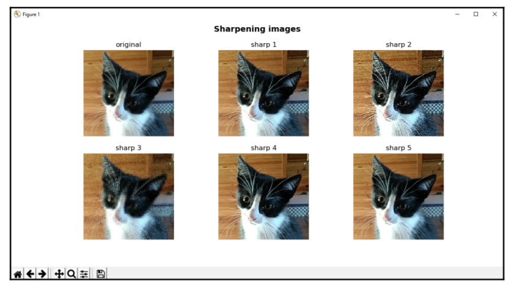
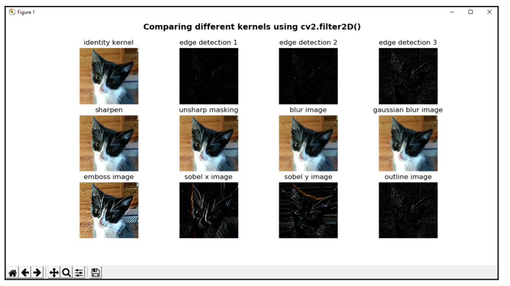
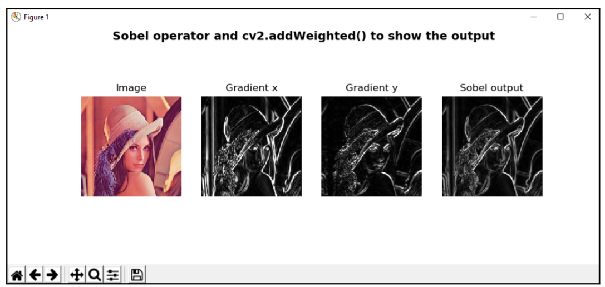
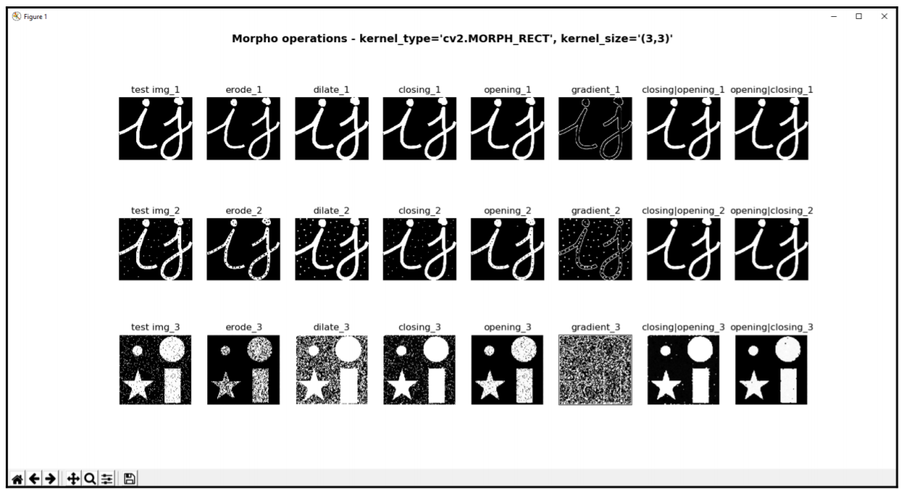
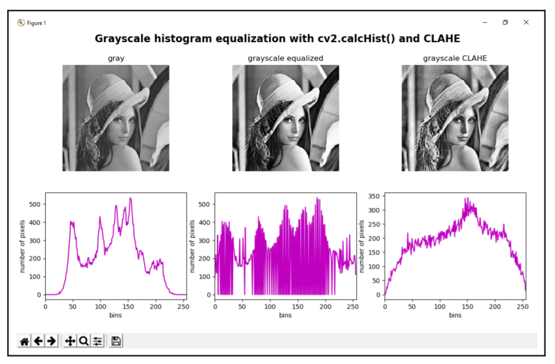
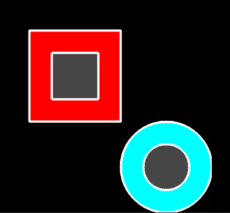
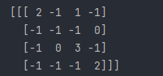

# 1. basic
- img đọc bởi opencv là BGR vì đơn giản là để tương thích vs nhiều pm đã có trước đây
- img đọc bởi matplotlib là RGB => vì vậy cần fai biết cách convert từ RGB <=> BGR

# 2. read images/videos/camera
## tua ngược video
- tính số frame trong video =  `cv2.CAP_PROP_FRAME_COUNT`
- loop while qua => ở đầu mỗi lần loop, set lại index của FRAME sử dụng `cap.set(cv2.CAP_PROP_POS_FRAMES, frame_index)`
- cuối vòng while add trừ frame_index đi 1 (do frame đã đc sử dụng trong while)
[link](https://github.com/PacktPublishing/Mastering-OpenCV-4-with-Python/blob/master/Chapter03/01-chapter-content/read_video_file_backwards.py)


# 3. basic shape
- basic: line, rectangle, circle
- advance: arrow, ellipse, đa giác
- add text: putText
- draw theo mouse event

# 4.a. transformation

## split - merge
cắt ảnh ra các channel và merge lại

# 4.b. geometric transformation: warpAffine
=> sử dụng matrix 2*3

## translation
- sử dụng cv2.warpAffine => dùng matrix 2*3: [[1,0,x],[0,1,y]]

```buildoutcfg
M = np.array([[1,0,x],[0,1,y]], dtype=np.float32)
dst = cv2.warpAffine(img, M, dsize=(img.shape[1], img.shape[0]))
```

## rotation
In order to rotate the image, we make use of the `cv2.getRotationMatrix2D()` function to  build the 2 x 3 transformation matrix
=> cũng sử dụng cv2.warpAffine như translation, chỉ thay `matrix = cv2.getRotationMatrix2D()`

## affine transform
trước đây đã đọc 1 chút về phần này nhưng k nhớ
opencv sử dụng `cv2.getAffineTransform(pts_1, pts_2)` để tạo matrix từ 2 điểm, sau đó `warpAffine` trên matrix đó

# 4.c. geometric transformation: warpPerspective
=> sử dụng matrix 3*3

```buildoutcfg
pts_1 = np.float32([[450, 65], [517, 65], [431, 164], [552, 164]])
pts_2 = np.float32([[0, 0], [300, 0], [0, 300], [300, 300]])
M = cv2.getPerspectiveTransform(pts_1, pts_2)
dst_image = cv2.warpPerspective(image, M, (300, 300))
```
trong tutorial 3hours, đã sử dụng func này để cắt ảnh lá bài bằng cách chọn các góc.  
trong đó pts1 là các góc, pts2 theo mình hiểu là 4 góc của ảnh lá bài sau khi cắt.

trong sách có nói: hàm `getPerspectiveTransform` cần 4 cặp điểm là tọa độ của tứ giác ở cả ảnh src và ảnh output


## resize
- phóng to thì cv2.INTER_CUBIC tốt hơn
- bth thì dùng cv2.INTER_LINEAR


## crop
slice array

# 5. image filtering
sử dụng kernel (filter) để transform ảnh (smoothing, sharpening, edge,..)

=> trong opencv, dùng `cv2.filter2D` để apply kernel(filter) vào ảnh

## smoothing (làm mịn)
có 1 số cách:
- dùng custom filter
- avg blur, gaussian blur, median blur => làm mịn kể cả edge
- Bilateral => làm mịn trừ edge

## sharpening (làm nét)
- cách đơn giản nhất là smoothed (sử dụng GaussianBlur) => sau đó addWeight để làm nét 
- ngoài ra có thể dùng custom filter [source](https://github.com/PacktPublishing/Mastering-OpenCV-4-with-Python/blob/master/Chapter05/01-chapter-content/sharpening_techniques.py)


## common filter
để sử dụng custom filter để thực hiện edge detection, smoothing, sharpening, or embossing => dùng `cv2.filter2D`
[source](https://github.com/PacktPublishing/Mastering-OpenCV-4-with-Python/blob/master/Chapter05/01-chapter-content/filter2D_kernels.py)




## cartoonized images
tạm thời bỏ qua
trong opencv có thể dùng `cv2.pencilSketch` hoặc `cv2.stylization`


# 6. Arithmetic with images (số học trong images)
Saturation arithmetic (số học bão hòa?) => loại phép toán giới hạn giá trị trong range [min, max]
## image add/subtract
=> tăng giảm độ sáng của ảnh sử dụng `cv2.add` và `cv2.subtract`
ngoài ra có thể `merge 2 ảnh` vs nhau sử dụng `cv2.add` và `cv2.subtract`

## image blending
tương tự như `cv2.add`, nhưng có weight cho mỗi ảnh
=> sử dụng `cv2.addWeight`

image blending thường đc sử dụng cho thuật toán Sobel (thuật toán edge detector để nhấn mạnh các edge)


## bitwise
- chú ý binary imge fai cùng shape (kể cả channel)
- sử dụng bitwise operator nên tính toán nhanh

# 7. Morphological transformations (biến đổi hình thái)

- thường đc thực hiện trên bỉnary image => giúp xử lý nhiễu
- các operation:
  - dilation: mở rộng các boundary region (các edge)
  - eroded: thu hẹp các boundary
  - opening: eroded trước xong dilation
  - closing: dilation trước xong eroded
  - gradient: xác định diff giữa dilation và eroded của input image
  - tophat: xác định diff giữa input và opening
  - blackhat: xác định diff giữa input và closing

- `cv2.getStructuringElement()` => tạo kernel dựa trên size và shape

# 8. Color space
- sử dụng `cv2.cvtColor` để convert
- 1 số loại color space: `BGR, HSV, HSL,CIEL*a*b*,YCbCr` 
- mình thấy 2 ứng dụng của color space trong việc segmentation color (tách màu cam trong ảnh ô tô, trong book 
là tách màu skin)
```buildoutcfg
các bước để segment
- sử dụng cv2.cvtColor để convert space
- xác định range của màu cần segment (trong vd tách màu cam ô tô => tác giả đã dùng trackbars để xác định range),
trong ebook tác giả dùng range trong các article)
- dùng cv2.inRange để define ảnh theo lower/upper range
- dùng bitwise để merge => tách skin
```

# 9. Color map
`cv2.applyColorMap` => convert sang color map khác để dễ nhìn hơn (vd gray sang `cv2.COLORMAP_AUTUMN`,...)

ngoài ra có thể tạo custom color map (đọc sau)

# 10. historgram

## `cv2.calcHist()` 
- nếu image tông màu sáng thì hist sẽ là left skew => tập trung về bên phải (giá trị lớn)
- tông màu tối => right skew => tập trung về bên trái (giá trị nhỏ)

## `cv2.equalizeHist()` => cân bằng sáng (constrast)
- mình thấy calcHist và equalizeHist chỉ thực hiện đc trên từng channel => vì vậy để thực hiện trên ảnh multichannel thì cần loop qua
- để thực hiện equalizeHist trên color image, tốt nhất ko nên thực hiện trên space BGR vì `color shade changes dramatically`
=> nên convert sang các space khác trước như: HSV, HSL,.. => thực hiện equalize `only on the luminance channel` (vd HSV thì chỉ equalize trên channel `value`) => sau đó mới convert ngược lại BGR

## `CLAHE - Contrast Limited Adaptive Histogram Equalization`
=> đc đánh giá là cho kết quả và performance tốt hơn equlize histogram => vì vậy CLAHE thường đc sử dụng như bước đầu trong nhiều cv application


- chú ý là CLAHE cũng nên làm như equalize hist: ko nên thực hiện trên BGR, mà convert sang color space khác, và thực hiện CLAHE trên `only on the luminance channel`
```buildoutcfg
cla = cv2.createCLAHE(clipLimit=4.0)
H, S, V = cv2.split(cv2.cvtColor(img, cv2.COLOR_BGR2HSV))
eq_V = cla.apply(V)
eq_image = cv2.cvtColor(cv2.merge([H, S, eq_V]), cv2.COLOR_HSV2BGR)
```

## compare hist của 2 image
sử dụng `cv2.compareHist(H1, H2, method)`

có 4 method: cv2.HISTCMP_xxx (CORREL, CHISQR, INTERSECT, BHATTACHARYYA) => cho kết quả so sánh khá tương tự nhau

# 11. threshold

## basic
` cv2.threshold()`
- method này dùng để thực hiện image segmentation
- có thể dùng cho ảnh multichannel (cho kết quả tương tự như threshold trên từng channel và merge lại)
- The simplest thresholding methods replace each pixel in the source image with a `black` pixel if the pixel intensity is
`less` than some predefined constant (the threshold value), or a `white` pixel, if the pixel intensity is `greater` than the threshold value

```buildoutcfg
cv2.threshold(src, thresh, maxval, type, dst=None) -> retval, dst
```

- type => các loại threshold => có khá nhiều loại (tham khảo thêm trong sách). Tuy nhiên điểm khác nhau chỉ là công thức tính giá trị pixel của output
- maxval => giá trị đc set khi > thresh (chỉ áp dụng cv2.THRESH_BINARY và cv2.THRESH_BINARY_INV) `inv` là ngược lại

- pp này k đat kết quả tốt trong trường hợp điều kiện ánh sáng khác nhau

## Adaptive thresholding
- tự động tìm optimal threshold theo blocksize, set threshold theo local => tốt hơn theo global
- khắc phục điểm yếu của pp threshold trên = cách sử dụng adaptive (ngoài ra có thể dùng thêm bilateFilter - blur để làm ảnh mịn hơn)
- pp này theo flow: tính threshold theo blocksize thay vì chỉ định thresholg global như pp trên

```buildoutcfg
adaptiveThreshold(src, maxValue, adaptiveMethod, thresholdType, blockSize, C[, dst]) -> dst
```

- adaptivemethod: cv2.ADAPTIVE_THRESH_MEAN_C/cv2.ADAPTIVE_THRESH_GAUSSIAN_C => các pp tính threshold
- C -> chỉ là constant parameter để trừ đi sau khi tính đc mean/ weight  

## otsu threshold
- tự động tìm optimal threshold theo peak, set threshold theo global 
- otsu dùng trong trường hợp ảnh có histogram 2 peak
- threshold sẽ đc tự tính => vì vậy thresh đc set = 0
- trường hợp ảnh nhiễu nhiều => vẫn nên dùng filter để làm mịn ảnh, kết quả sẽ tốt hơn
```buildoutcfg
ret, imgResult = cv2.threshold(imgblur,thresh=0, maxval=255, type=cv2.THRESH_BINARY + cv2.THRESH_OTSU)
```

## triangle threshold
- tự động tìm optimal threshold, set threshold theo global 
- code tương tự như otsu, chỉ khác quy tắc tính optimal threshold

# 11.b. threshold using scikit-image
ngoài ra, có thể sử dụng threshold trong skimage
```buildoutcfg
from skimage.filters import threshold_otsu, threshold_triangle, threshold_sauvola, threshold_niblack
from skimage import img_as_ubyte
.......
thresh = threshold_otsu(imgGray)
binary = imgGray > thresh
binary = img_as_ubyte(binary)
cv2.imshow('threshold_otsu', binary)
.......
```
# 12. contour detector
=> dùng trong bài toán shape analysis, object detection, recognition

## introduce
- nếu dùng `mode=cv2.RETR_TREE`:

 

```buildoutcfg
hierachy[i][0] => index của next contour cùng hierachy level (vd hierachy[0][0] = 2 => contour cùng level tiếp theo ở index 2) 
hierachy[i][1] => index của prev contour cùng hierachy level (vd hierachy[2][1] = 0 => prev contour của contour index 2 là index 0)
hierachy[i][2] => index của first child (vd hierachy[0][2] = 1 => contour index 1 là con của contour index 0)
hierachy[i][3] => index của parent (vd hierachy[0][3] = -1 => contour index0 ko có parent, hierachy[3][3] = 2 => contour index 3 có parent là index 2)
```

các func dùng: 
- `cv2.findContours` => find contour từ image binary
- `cv2.drawContours` => draw contour theo từng contours
